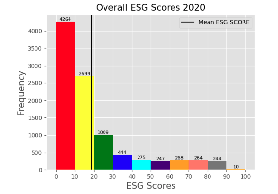
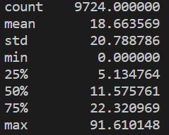
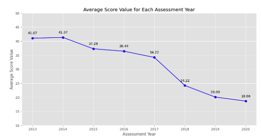

# CMC FinTech Hackathon

## Our Project

While greatest obligation of a business is to its stockholders, companies nowadays have to be mindful 
about the various impacts that they may have on society, especially on the environmental, social, and governance 
aspects. In this project, we aim to analyze and research the different ESG scores from the database provided to
us from SMP Global through Snowflake.

## Going In Depth

1. Gathering Data
2. Visualizations
3. Analysis

### Gathering Data

We gathered most of the data from Snowflake through Python and querying the data with SQL. We also used a 
specialized Snowflake library to clean up the data by installing:

```
$ pip install snowflake-connector-python[pandas]
```

### Visualizations

Using the matplotlib library, we created several graphs (which can be replaced with several other variables)
and visualizations that demonstrate various findings such as Overall ESG Scores in 2020 (Figure 1), Summary
Statistics for ESG Scores in 2020 (Figure 2), Average Score Value for Each Assessment Year, and more. 
You can see some examples here:

Figure 1


Figure 2


Figure 3


Keep in mind that all the data provided can be replaced with different years, variables, etc. 

### Analysis

From this project, we learned that although ESG scores are relatively imperative to today's society, many
companies fail to land a decent score (though ESG scores are gradually rising). Many companies seem to score
a 0 for the ESG scores (which could be attributed to a lack of attention, private companies, startups, etc.).
Speaking for each aspect of ESG scores, companies on average scored the least on the social aspect while doing
better in the economic (transition to electricity/solar) and governance (better boards, realization of workers'
rights, etc.) aspects. Though this may be the case, it becomes apparent that companies must do better to increase
their scores, particularly within the social category. You can see a more in-depth analysis on our write-up for 
the project!

## The Future

So, what are our next steps? Well, if we had more time, we would want to run multiple regressions on the different
variables in the Snowflake dataset using ESG scores as the independent variable and running it against the use of
hashtags on Twitter, increase or decrease in startups, and more. We would also like to check for autocorrelation, 
run various tests, and implement different statistical models that may explain or provide us with ways to solve or aide
the development and research into ESG as a whole. One flaw we found with the ESG scores was that it only focused on
how companies operated, and completely disregarded the sustainability and second-hand impact of society.